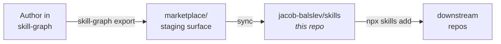

# skills — the public Skill Graph library

[](https://github.com/jacob-balslev/skill-graph/blob/main/schemas/skill.v6.schema.json) [](LICENSE) [](https://skills.sh) [](https://github.com/jacob-balslev/skills/stargazers)

> **The public, open-source skill library for AI agents.** Each skill is a portable `SKILL.md` file packaged with optional `scripts/`, `references/`, and `evals/`. Authored and exported from [`skill-graph`](https://github.com/jacob-balslev/skill-graph); distributed via [skills.sh](https://skills.sh) and direct GitHub install.

---

## Install

```bash
npx skills add jacob-balslev/skills
```

This fetches the canonical skill library and drops the categorized tree (`skills/<category>/<name>/SKILL.md`) into your project. The skills follow the plain `SKILL.md` packaging shape used by Claude Code, Codex, Gemini CLI, and any other [Skill Metadata Protocol](https://github.com/jacob-balslev/skill-graph/blob/main/docs/SKILL_METADATA_PROTOCOL.md)-aware agent runtime.

**Verify the install:**

```bash
ls skills/quality/a11y/SKILL.md   # should exist after install
head -20 skills/quality/a11y/SKILL.md
```

## What's in here

Skills are organized into six top-level categories under `skills/`. Each category folder contains one directory per skill, and each skill directory contains a `SKILL.md` plus optional `evals/` and `references/`.

| Category | Folder | What's covered |
|---|---|---|
| **Agent** | [`skills/agent/`](skills/agent/) | Agent engineering, orchestration, AI-native development, autonomous loop patterns, content monitoring, eval-driven development |
| **Design & UX** | [`skills/design/`](skills/design/) | Accessibility, visual design, design tokens, motion, typography, color science, dark mode, responsive, breakpoints, layout |
| **Engineering** | [`skills/engineering/`](skills/engineering/) | API design, debugging, observability, performance, testing strategy, version control, refactoring, database migration, integrations |
| **Foundations** | [`skills/foundations/`](skills/foundations/) | Semantics, taxonomy, ontology, conceptual modeling, domain modeling, naming conventions, glossary, entity-relationship modeling |
| **Product** | [`skills/product/`](skills/product/) | Product surfaces, customer-facing skill patterns |
| **Quality** | [`skills/quality/`](skills/quality/) | Best practice, evaluation, self-review, code review, design review, BARS-anchored scoring, anti-shortcut enforcement, a11y |

Browse the full set at [skills.sh](https://skills.sh) or open any `skills/<category>/<name>/SKILL.md` directly in this repo.

## How skills get here

This repo is **read-only by convention** — skills are authored in [`skill-graph`](https://github.com/jacob-balslev/skill-graph) and exported here via the marketplace pipeline:



The export pipeline applies provenance, description-limit, privacy, and dead-link gates before staging — so what lands here is the privacy-cleaned, OSS-portable, v6-compliant subset. See [`docs/marketplace-syndication.md`](https://github.com/jacob-balslev/skill-graph/blob/main/docs/marketplace-syndication.md) in `skill-graph` for the full workflow.

If you want to **propose a new skill or fix existing content**, open the issue or PR in [`skill-graph`](https://github.com/jacob-balslev/skill-graph). Direct edits in this repo land in the next export and may be overwritten.

## Curation policy

Not every skill authored in `skill-graph` lands here. The OSS canonical surface excludes:

- Personal or tenant-specific skills (e.g. Sales Hub internal workflows)
- Skills with PII, private credentials, or non-public truth sources
- Skills with descriptions that violate the description-limit gate
- Skills that have not yet passed the v6 schema migration

See [ADR 0008 — skill surface split and curation policy](https://github.com/jacob-balslev/skill-graph/blob/main/docs/adr/0008-skill-surface-split-and-curation-policy.md) in `skill-graph` for the full doctrine.

## Anatomy of a skill

A skill is a folder. The minimum is:

```
my-skill/
├── SKILL.md              # The skill body + v6 frontmatter
├── references/           # Optional deep-dive markdown (linked from SKILL.md)
└── evals/                # Optional eval fixtures
```

The frontmatter declares **identity** (`name`, `description`, `type`, `category`), **activation signals** (`keywords`, `triggers`, `examples`, `anti_examples`, `paths`), **relations** (`related`, `depends_on`, `boundary`), **grounding** (`truth_sources`, `failure_modes`), and the v6 **Health Block** (`last_audited`, `audit_verdict`, `eval_score`, `drift_status`). The body is the procedure an agent loads.

The full normative spec is [`SKILL_METADATA_PROTOCOL.md`](https://github.com/jacob-balslev/skill-graph/blob/main/docs/SKILL_METADATA_PROTOCOL.md) in `skill-graph`.

## The Skill Graph ecosystem

<p align="center">
  
</p>

| Repo | Status | Purpose |
|---|---|---|
| [skill-graph](https://github.com/jacob-balslev/skill-graph) | **active** | Canonical home — protocol spec, schemas, CLI, lint, manifest, router, drift, audit loop, export |
| **skills** *(this repo)* | **active** | Public open-source skill library distributed via `npx skills add jacob-balslev/skills` |
| [skill-metadata-protocol](https://github.com/jacob-balslev/skill-metadata-protocol) | mirror | Historical docs-only mirror of the normative spec |
| [skill-audit-loop](https://github.com/jacob-balslev/skill-audit-loop) | mirror | Historical docs-only mirror of the audit procedure |

## Contributing & Trust

- **Propose a new skill or fix content** → open an issue or PR in [`jacob-balslev/skill-graph`](https://github.com/jacob-balslev/skill-graph/issues). The export pipeline lands changes here automatically.
- **Library-level bugs** (missing skill, broken link, manifest issue) → file via the [bug template](.github/ISSUE_TEMPLATE/bug.yml) in this repo.
- **Security** — report vulnerabilities privately via the [security policy](SECURITY.md), not as public issues.
- **Code of Conduct** — this project follows the [Contributor Covenant 2.1](CODE_OF_CONDUCT.md).
- **License** — skill content is licensed under [CC-BY-4.0](LICENSE). When redistributing or building derivative works, attribute as:
  > _"Skills from Skill Graph (https://github.com/jacob-balslev/skill-graph), licensed CC-BY-4.0."_

## Why no `package.json`?

This repo is **not an npm package**. Skills are consumed by reading the markdown directly — either via `npx skills add` (which clones and copies), git submodule, or direct download. There is no runtime to install. If you want the authoring tooling, install [`@skill-graph/cli`](https://www.npmjs.com/package/@skill-graph/cli) from the [`skill-graph`](https://github.com/jacob-balslev/skill-graph) repo.
